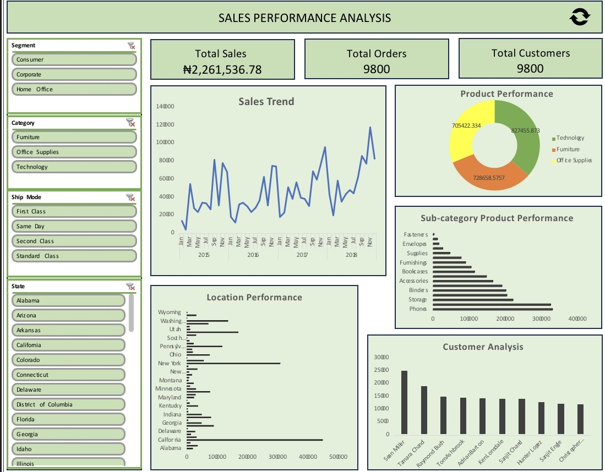

# sales-analysis-dashboard
Sales dataset analysis using Excel to uncover business insights and build an interactive dashboard

# Dashboard Preview

# Project Title
Sales Performance Analysis

## Project Objective
This project analyzes sales data to uncover trends in customer behavior, product performance, and regional distribution, with the goal of generating actionable business insights.

## Dataset Description
The dataset includes order-level sales information such as:
- Order details (Order ID, Order Date, Ship Date, Ship Mode)
- Customer information (Customer ID, Customer Name, Segment)
- Geographic data (Country, State, City)
- Product details (Category, Sub-Category, Product Name)
Sales values

## Tools Used
- Microsoft Excel
- Power Query (Data Cleaning)
- Pivot Tables & Charts (Analysis & Visualization)

## Key Insights
- Notable high-performing periods occur around March, September, and November across different years.
- The Technology category generates the highest saleswith Phones emerging as the top-performing sub-category by a significant margin, indicating strong demand for high-value products.
- California, New York and Texas stand out as the three top-performing state, generating the highest sales overall. Several regions show significantly lower performance, indicating uneven market penetration.
- Sales are distributed across multiple customers, with a noticeable concentration among top buyers.

## Recommendation
- Leverage seasonal peaks by increasing marketing efforts and inventory ahead of high-performing months.
- Focus on high-performing categories, particularly Technology and Phones, while using bundling strategies to increase overall sales value.
- Strengthen engagement in top-performing regions and implement targeted campaigns to improve performance in underpenetrated markets.
- Retain high-value customers through loyalty initiatives while expanding the broader customer base to ensure sustainable growth.

